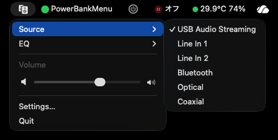

# Edf Controller

Edifier S880DB MKIIをmacOSのメニューバーから操作するネイティブアプリです。



## インストール

[Homebrew](https://brew.sh/)を使用してインストールします。

```sh
brew install --cask rioriost/cask/edf-controller
open -a "Edf Controller"
```

初回起動時にmacOSから確認された場合は、Bluetoothの使用を許可してください。更新は次のコマンドで行えます。

```sh
brew update
brew upgrade --cask edf-controller
```

## メニュー

- `Source`: USB Audio Streaming / Line In 1 / Line In 2 / Bluetooth / Optical / Coaxial
- `EQ`: Monitor / Dynamic / Classic / Vocal / Customized
- `Volume`: SF Symbolsの小・大スピーカーアイコンとスライダー
- `Settings…`: 自動選択または特定のスピーカーを指定。Customized EQを6バンド（−3〜+3 dB、0.5 dB刻み）で調整
- `Quit`

キーボードショートカットは割り当てていません。

## Settingsを残す理由

既定値は`Automatic (Recommended)`です。検出した互換スピーカーのうち電波が最も強い1台に接続するため、通常は設定不要です。

一方、macOSの現在の音声出力先とCoreBluetoothで見えるBLE機器を、汎用的かつ確実に対応付けるAPIはありません。同じ機種が複数ある環境で誤ったスピーカーを操作しないよう、SettingsからCoreBluetoothの機器IDを固定できます。固定した機器が見つからない場合、別の機器へはフォールバックしません。

## 必要環境

- macOS 13 Ventura以降
- Xcode 16以降（ビルド時）
- Edifier S880DB MKII

## 開発

```sh
make check
make app
open "dist/Edf Controller.app"
```

`build-app.sh`はarm64とx86_64を含むUniversal Binaryを生成し、通常はad-hoc署名します。Developer IDで署名する場合は次のように指定します。

```sh
make app-signed VERSION=0.1.4
```

## NotarizeとHomebrew cask

Apple IDとapp-specific passwordをKeychainへ一度だけ登録します。認証情報はリポジトリや環境変数へ保存しません。

```sh
xcrun notarytool store-credentials git-labeler-notary \
  --apple-id "APPLE_ID" \
  --team-id "" \
  --password "APP_SPECIFIC_PASSWORD"
```

`git-labeler`と同じKeychain profile名を既定値として使用します。リリース先の既定値は`https://github.com/rioriost/edf-controller`です。

```sh
make notarize-macos VERSION=0.1.4
```

別のnotary profileまたは公開先を使う場合は、`NOTARY_PROFILE`、`CASK_RELEASE_BASE_URL`、`CASK_HOMEPAGE`を`make`へ指定できます。公開URLは直下へ`v0.1.4/EdfController-0.1.4.zip`を配置できる形式にします。

この処理はDeveloper ID署名、notary serviceへの送信、ticketのstaple、Gatekeeper検証、配布ZIP作成を行い、実際のバージョン・SHA-256・公開URLを含む`../homebrew-cask/Casks/edf-controller.rb`を生成します。出力先は`CASK_OUTPUT`で変更できます。

Notarizationの手順はAppleの[Notarizing macOS software before distribution](https://developer.apple.com/documentation/security/notarizing-macos-software-before-distribution)および[Developer ID](https://developer.apple.com/developer-id/)に準拠しています。caskの記述は[Homebrew Cask Cookbook](https://docs.brew.sh/Cask-Cookbook)を参照してください。

## 注意

本アプリは非公式ツールです。現時点ではS880DB MKIIのみを対象としています。

## License

本ソフトウェアは[MIT License](LICENSE)で公開しています。
